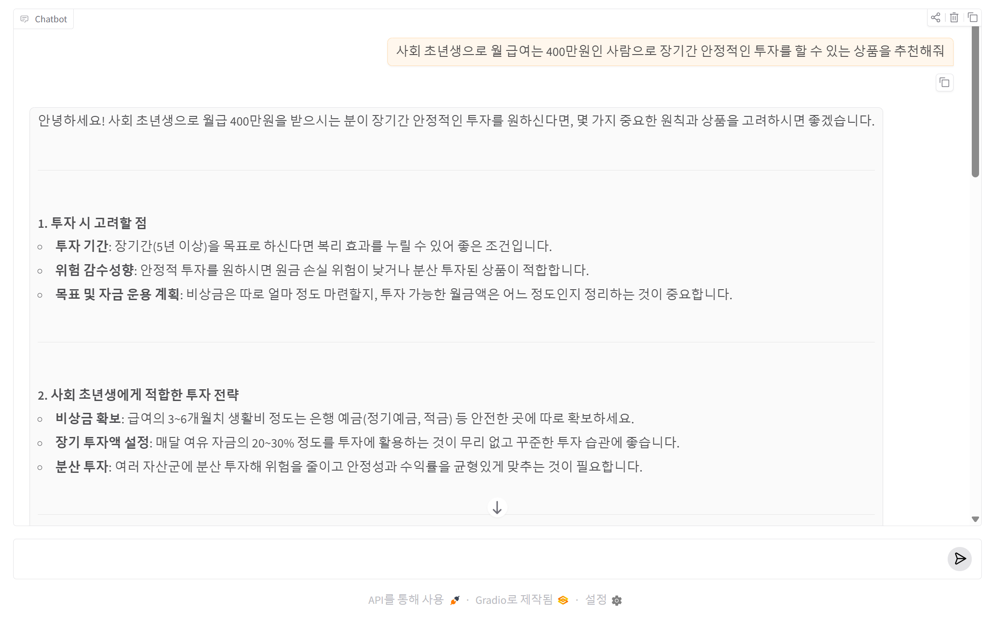

# AI의 직업 / 성격 / 규칙 / 행동원칙 설정

`role="system"` 은 OpenAI Chat Completions API에서
모델의 **행동 규칙**, **역할**, **스타일**, **제약조건**을 지정하는 가장 중요한 프롬프트입니다.

쉽게 말하면:

```text
AI의 직업 / 성격 / 규칙 / 행동원칙
```

을 정의하는 부분입니다.

---

# 1. 기본 구조

OpenAI API는 보통 아래 구조를 사용합니다.

```python id="g52xj6"
messages = [
    {
        "role": "system",
        "content": "너는 금융 AI 엔지니어이다."
    },
    {
        "role": "user",
        "content": "신용카드 이상거래 탐지 코드를 만들어줘"
    }
]
```

---

# 2. role 종류

| role      | 의미         |
| --------- | ------------ |
| system    | AI 행동 규칙 |
| user      | 사용자 질문  |
| assistant | 이전 AI 답변 |

---

# 3. system role 의 핵심 역할

`system` 은 모델에게:

```text
"너는 누구인가?"
"어떻게 답해야 하는가?"
"무엇을 하면 안 되는가?"
```

를 정의합니다.

---

# 4. 왜 중요한가?

같은 질문이라도 system prompt에 따라 결과가 완전히 달라집니다.

---

# 예시 1 — 일반 AI

```python id="tjlwm8"
{
    "role": "system",
    "content": "너는 친절한 AI 비서이다."
}
```

질문:

```text id="y9bsb4"
Docker란?
```

응답:

```text id="m1n0cs"
Docker는 컨테이너 기반 가상화 플랫폼입니다.
```

---

# 예시 2 — DevOps 전문가

```python id="5t1r3x"
{
    "role": "system",
    "content": "너는 시니어 DevOps 엔지니어이다."
}
```

응답:

```text id="pcrfsk"
Docker는 애플리케이션을 컨테이너 단위로 패키징하여
CI/CD 및 Kubernetes 환경에서 일관되게 실행하기 위한 플랫폼이다.
```

전문성이 달라집니다.

---

# 5. 실무에서 system prompt가 중요한 이유

LLM 품질의 상당 부분은:

```text
Prompt Engineering
```

에 의해 결정됩니다.

특히:

```text
system prompt
```

는 AI의 전체 방향성을 결정합니다.

---

# 6. 가장 많이 사용하는 system prompt 유형

---

## (1) 역할(Role) 지정

```python id="i5tq1r"
{
    "role":"system",
    "content":"너는 금융 AI 엔지니어이다."
}
```

---

## (2) 출력 형식 제한

```python id="1vvpc5"
{
    "role":"system",
    "content":"반드시 Python 코드만 출력해라."
}
```

---

## (3) 스타일 지정

```python id="r8g70e"
{
    "role":"system",
    "content":"초보자도 이해할 수 있게 설명해라."
}
```

---

## (4) 금지 규칙

```python id="q7k2g2"
{
    "role":"system",
    "content":"markdown 없이 순수 JSON만 출력해라."
}
```

---

## (5) 응답 품질 강화

```python id="pwz2kh"
{
    "role":"system",
    "content":"항상 단계별 reasoning 후 답변해라."
}
```

---

# 7. 실제 실무형 예시

---

# AI 코드 생성기

```python id="6sy4l8"
SYSTEM_PROMPT = """
너는 시니어 Python AI 엔지니어이다.

규칙:
- 실행 가능한 코드만 생성
- 상세 주석 포함
- 함수 기반으로 작성
- 예외 처리 포함
- 실무 스타일 코드 작성
"""
```

---

# 금융 AI 시스템

```python id="vnn2u7"
SYSTEM_PROMPT = """
너는 금융 데이터 분석 전문가이다.

규칙:
- 금융권 실무 기준 적용
- Precision/Recall/F1 모두 출력
- 클래스 불균형 고려
- Feature Importance 분석 포함
"""
```

---

# Kubernetes 전문가

```python id="qq5tq4"
SYSTEM_PROMPT = """
너는 Kubernetes 플랫폼 엔지니어이다.

규칙:
- YAML 포함
- 운영 환경 기준 설명
- 보안 설정 포함
- Helm 기반 예시 우선
"""
```

---

# 8. system prompt를 잘 만드는 핵심

좋은 system prompt는 보통:

```text
역할
+
규칙
+
출력 형식
+
금지 사항
+
품질 조건
```

조합입니다.

---

# 9. 추천 구조

```python id="pw0h8z"
SYSTEM_PROMPT = """
너는 시니어 AI 엔지니어이다.

규칙:
1. 반드시 실행 가능한 코드 생성
2. 상세 주석 포함
3. 함수 기반 작성
4. 실무 기준 적용
5. 성능 최적화 고려

출력 형식:
- markdown code block 사용
- 설명은 코드 아래 작성

금지:
- 불완전 코드 금지
- pseudo code 금지
"""
```

---

# 10. 왜 history보다 system이 더 중요한가?

실제로 모델 우선순위는:

```text
system
>
developer
>
user
>
assistant
```

순입니다.

즉:

```text
system prompt가 AI 성격을 결정
```

합니다.

---

# 11. 실무에서의 고급 활용

고급 AI 시스템은 system prompt를 동적으로 변경합니다.

예:

| 사용자 유형 | system prompt    |
| ----------- | ---------------- |
| 초보자      | 쉽게 설명        |
| 개발자      | 코드 중심        |
| 금융권      | 보안/규제 강조   |
| DevOps      | 운영 자동화 강조 |

---

# 12. OpenAI API 전체 예제

파일명 : step6.py

```python id="r6rybc"
from openai import OpenAI
import os

client = OpenAI(
    api_key=os.getenv("OPENAI_API_KEY")
)

messages = [
    {
        "role": "system",
        "content": """
        너는 시니어 금융 AI 엔지니어이다.

        규칙:
        - Python 코드만 생성
        - XGBoost 사용
        - 실무 기준 적용
        """
    },
    {
        "role": "user",
        "content": """
        신용카드 이상거래 탐지 코드를 작성해줘
        """
    }
]

response = client.chat.completions.create(
    model="gpt-4.1",
    messages=messages
)

print(response.choices[0].message.content)
```
## 1. 실행 방법

```bash
python step6.py

```

## 2. 실행 결과 
```python
import pandas as pd
import numpy as np
from sklearn.model_selection import train_test_split, StratifiedKFold
from sklearn.metrics import classification_report, roc_auc_score
from xgboost import XGBClassifier
import joblib

# 데이터 로딩 (예시: CSV 파일)
data = pd.read_csv('creditcard.csv')

# 예시 데이터 전처리
data = data.sample(frac=1, random_state=42)  # 섞기
X = data.drop(['Class'], axis=1)
y = data['Class']

# 불균형 데이터 처리: 가중치로 보완하거나, 언더/오버샘플링 적용
neg, pos = np.bincount(y)
scale_pos_weight = neg / pos  # XGBoost의 파라미터 설정

# 데이터 분할 (실무에서는 stratify)
X_train, X_test, y_train, y_test = train_test_split(
    X, y, test_size=0.2, stratify=y, random_state=42
)

# XGBoost 모델 설정 (실무 하이퍼파라미터 예시)
params = {
    'n_estimators': 300,
    'max_depth': 6,
    'learning_rate': 0.03,
    'subsample': 0.9,
    'colsample_bytree': 0.7,
    'scale_pos_weight': scale_pos_weight,
    'random_state': 42,
    'use_label_encoder': False,
    'eval_metric': 'auc',
    'tree_method': 'hist'
}

model = XGBClassifier(**params)

# K-Fold 교차검증 (실무 기준)
cv = StratifiedKFold(n_splits=5, shuffle=True, random_state=42)
for fold, (train_idx, val_idx) in enumerate(cv.split(X_train, y_train)):
    X_tr, X_val = X_train.iloc[train_idx], X_train.iloc[val_idx]
    y_tr, y_val = y_train.iloc[train_idx], y_train.iloc[val_idx]
    model.fit(
        X_tr, y_tr,
        early_stopping_rounds=30,
        eval_set=[(X_val, y_val)],
        verbose=10
    )

# 테스트 평가
y_pred = model.predict(X_test)
y_pred_proba = model.predict_proba(X_test)[:, 1]
print(classification_report(y_test, y_pred, digits=4))
print("ROC AUC:", roc_auc_score(y_test, y_pred_proba))

# 모델 저장
joblib.dump(model, 'xgb_fraud_model.pkl')

```
---

# 13.  OpenAI API와 Gradio와 연동하는 전체 소스 

파일명 : step9.py

```python
from openai import OpenAI
import gradio as gr
import os
from fastapi import FastAPI

# =========================================
# System Prompt
# =========================================

SYSTEM_PROMPT = """
너는 친절한 금융 전문 AI 비서이다.
답변은 자세하고 이해하기 쉽게 설명해라.
"""

#최대 이력은 이전 5건으로 설정함 
MAX_HISTORY = 5

client = OpenAI(
    api_key=os.getenv("OPENAI_API_KEY")
)

def chat(message, history):
    # history 구조 출력합니다
    print(history)

    # 최근 5개만 유지
    history = history[-MAX_HISTORY:]
    messages = [];

    # system role 추가
    messages.append({
        "role": "system",
        "content": SYSTEM_PROMPT
    })

    #이전 질문 및 답변을 추가합니다
    for item in history:
        messages.append({
            "role": item["role"],
            "content": item["content"][0]["text"]
        })

    messages.append({
        "role":"user",
        "content":message
    })

    response = client.chat.completions.create(
        model="gpt-4.1-mini",
        messages=messages,
        stream=True
    )

    partial_message = ""

    # --------------------------------
    # 스트리밍 데이터 수신
    # --------------------------------
    for chunk in response:

        delta = chunk.choices[0].delta.content

        if delta is not None:

            partial_message += delta

            # 실시간 출력
            yield partial_message


demo = gr.ChatInterface(chat)

# -----------------------------
# FastAPI 생성
# -----------------------------
app = FastAPI()

# -----------------------------
# FastAPI에 Gradio 연결
# -----------------------------
app = gr.mount_gradio_app(
    app,
    demo,
    path="/"
)

# 실행 방법
# uvicorn step8:app --reload --host 0.0.0.0 --port 8000
# 질문 : 사회 초년생으로 월 급여는 400만원인 사람으로 장기간 안정적인 투자를 할 수 있는 상품을 추천해줘  

```



# 핵심 정리

| 항목            | 설명               |
| --------------- | ------------------ |
| system          | AI 행동 규칙       |
| user            | 사용자 질문        |
| assistant       | 이전 답변          |
| 가장 중요       | system prompt      |
| 실무 핵심       | Prompt Engineering |
| 품질 결정 요소  | system 설계        |

즉:

```text
좋은 AI 결과
=
좋은 system prompt
```

라고 봐도 됩니다.


