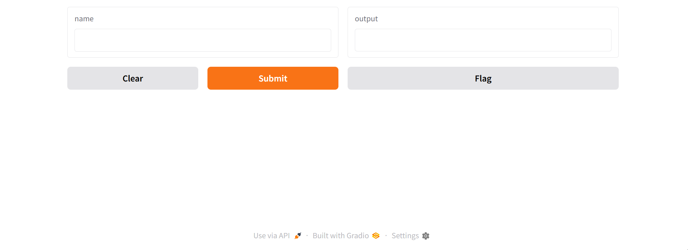
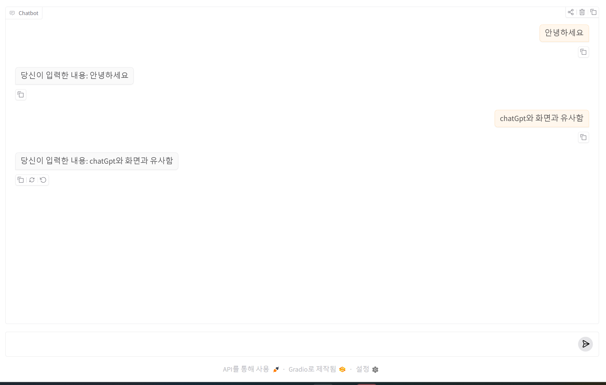
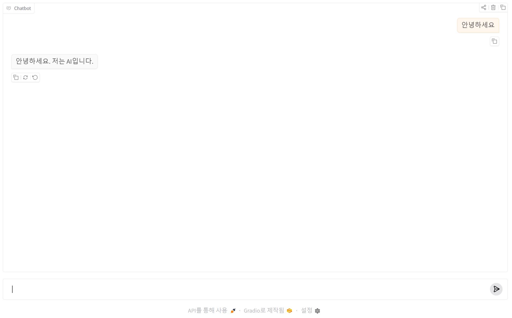

# Gradio 란?

Gradio는 Python 코드만으로:

* ChatGPT 스타일 챗봇
* 이미지 AI
* 음성 AI
* YOLO 데모
* LLM 서비스
* FastAPI 연동 웹 UI

를 매우 빠르게 만들 수 있는 라이브러리입니다.

특히:

```text
Python 함수 → 웹 UI 자동 생성
```

이 핵심입니다.

---

# 1. Gradio의 특징

## 장점

| 기능           | 설명                    |
| -------------- | ----------------------- |
| 매우 쉬움      | 몇 줄이면 웹 UI 생성    |
| AI 특화        | LLM/YOLO/STT/TTS 최적화 |
| Chat UI 지원   | ChatGPT 스타일          |
| 스트리밍       | yield 기반              |
| 멀티모달       | 이미지/음성/파일        |
| FastAPI 연동   | 공식 지원               |
| Docker 친화적  | 배포 쉬움               |
| GPU AI 연동    | 매우 좋음               |

---

# 2. 설치 방법

## (1) 가상환경 생성 (추천)

Linux / Ubuntu 기준:

```bash
python3 -m venv venv
```

활성화:

```bash
source venv/bin/activate
```

Windows:

```bash
venv\Scripts\activate
```

---

## (2) pip 업그레이드

```bash
pip install --upgrade pip
```

---

## (3) Gradio 설치

```bash
pip install gradio
```

최신 버전 설치됩니다.

---

# 3. 설치 확인

```bash
python
```

```python
import gradio as gr

print(gr.__version__)
```

---

# 4. 가장 기본적인 예제

## Hello World

```python
import gradio as gr

def hello(name):
    return f"안녕하세요 {name}"

demo = gr.Interface(
    fn=hello,
    inputs="text",
    outputs="text"
)

demo.launch()
```

실행:

```bash
python app.py
```

접속:

```text
http://127.0.0.1:7860
```

실행 결과 화면  



```python
import gradio as gr

def greeing(name):
    return f"안녕하세요 {name}"

demo = gr.Interface(
    fn=greeing,
    inputs="text",
    outputs="text"
)

demo.launch()
```

```text
hello() 함수
↓
자동으로 웹 UI 생성
↓
브라우저에서 사용 가능
```

구조입니다.

---

# 1. 전체 동작 흐름

이 코드가 실행되면:


브라우저에 다음과 같은 화면이 생성됩니다.

```text
+----------------------+
| 입력창               |
+----------------------+

        [Submit]

출력:
안녕하세요 홍길동
```

---

# 2. import gradio as gr

```python
import gradio as gr
```

의미:

```text
Gradio 라이브러리를 가져온다
```

---

## 왜 gr 로 줄여 쓰는가?

보통 Python에서는:

| 라이브러리        | 별칭 |
| ----------------- | ---  |
| numpy             | np   |
| pandas            | pd   |
| matplotlib.pyplot | plt  |
| gradio            | gr   |

처럼 짧게 사용합니다.

---

# 3. 함수 정의

```python
def hello(name):
```

이 부분은 일반 Python 함수입니다.

---

## 함수 구조

| 요소  | 의미      |
| ----- | --------- |
| hello | 함수 이름 |
| name  | 입력값    |

즉:

```text
사용자가 입력한 문자열
↓
name 변수로 전달
```

됩니다.

---

# 4. return 부분

```python
return f"안녕하세요 {name}"
```

Python의 f-string 문법입니다.

---

## 예시

입력:

```python
name = "홍길동"
```

결과:

```python
"안녕하세요 홍길동"
```

---

# 5. 가장 중요한 부분

## gr.Interface()

```python
demo = gr.Interface(
```

이 부분이 핵심입니다.

의미:

```text
Python 함수를 웹 UI로 변환
```

합니다.

---

# 6. fn=greeting

```python
fn=greeting
```

의미:

```text
웹 UI와 연결할 함수
```

입니다.

즉:

```text
사용자 입력
↓
greeting() 함수 실행
↓
결과 반환
```

구조.

---

# 7. inputs="text"

```python
inputs="text"
```

의미:

```text
입력 UI 타입 지정
```

---

## text 의미

```text
문자열 입력창(Textbox)
```

생성.

즉 브라우저에:

```text
[________________]
```

같은 입력창이 만들어집니다.

---

# 8. outputs="text"

```python
outputs="text"
```

의미:

```text
출력 UI 타입 지정
```

즉 결과를 문자열로 출력.

---

# 9. 실제 내부 동작 과정

예를 들어 사용자가:

```text
홍길동
```

입력 후 Submit 클릭.

---

## Step 1

브라우저 입력:

```text
홍길동
```

---

## Step 2

Gradio가 함수 호출:

```python
greeting("홍길동")
```

---

## Step 3

함수 실행:

```python
return "안녕하세요 홍길동"
```

---

## Step 4

결과를 웹 UI에 출력.

---

# 5. ChatGPT 스타일 챗봇 만들기

## 가장 중요한 기본 예제

```python
import gradio as gr

def chat(message, history):
    return f"당신이 입력한 내용: {message}"

demo = gr.ChatInterface(chat)

demo.launch()
```

---

# 6. 웹서버 실행 

```python
python chat.py
```

---

# 7. 브라우저에서 주소창에 http://127.0.0.1:7860 실행 화면 



---

# 8. ChatInterface 구조 이해

## 함수 구조

```python
def chat(message, history):
```

| 변수    | 의미      |
| ------- | --------- |
| message | 현재 입력 |
| history | 이전 대화 |

---

## history 예시

```python
[
  ["안녕", "안녕하세요"],
  ["이름은?", "GPT입니다"]
]
```

---

# 9. 스트리밍(ChatGPT 느낌) 구현

## 핵심 기능

```python
yield 문자열메시지
```

사용.

---

## 예제

```python
import time
import gradio as gr

def chat(message, history):

    text = "안녕하세요. 저는 AI입니다."

    partial = ""

    for c in text:
        partial += c
        time.sleep(0.05)
        yield partial

demo = gr.ChatInterface(chat)

demo.launch()
```

# 10. 웹서버 실행 

```python
python chat.py
```

---

# 11. 브라우저에서 주소창에 http://127.0.0.1:7860 실행 화면 

입력창에 안녕하세요 입력하고 엔터를 누르면 아래와 같이 응답 결과를 받아 출력됩니다  



---
