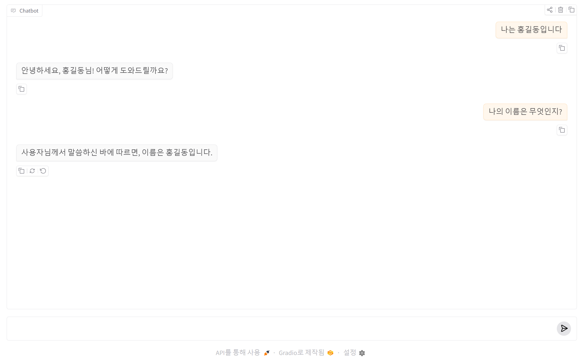

# Gradio 에서 대화 이력(history) 관리 방법

현재 사용 중인 코드:

```python id="l6w1na"
def chat(message, history):
```

에서:

```python id="awjlwm"
history
```

가 바로:

```text id="b9jlwm"
이전 대화 기록
```

입니다.

즉:

```text id="c0jlwm"
ChatGPT의 대화 기억
```

역할.

---

# 1. 이전 코드의 문제점

현재 코드는 보통 이렇게 되어 있음:

```python id="d1jlwm"
messages=[
    {
        "role":"user",
        "content":message
    }
]
```

즉:

```text id="e2jlwm"
현재 질문만 OpenAI에 전달
```

합니다.

---

# 결과

AI가:

```text id="f3jlwm"
이전 대화 내용을 기억 못함
```

---

# 예시

## 사용자

```text id="g4jlwm"
내 이름은 홍길동이야
```

↓

## 다음 질문

```text id="h5jlwm"
내 이름이 뭐야?
```

↓

## 현재 코드 결과

```text id="i6jlwm"
모름
```

---

# 2. 해결 방법

# history를 OpenAI messages로 변환

핵심:

```text id="j7jlwm"
history
↓
OpenAI messages 형식 변환
```

해야 함.

---

# 3. OpenAI messages 구조 이해

OpenAI는 이런 형식 요구.

```python id="k8jlwm"
messages = [
    {
        "role":"user",
        "content":"안녕"
    },
    {
        "role":"assistant",
        "content":"안녕하세요"
    }
]
```

---

# 4. Gradio history 구조

Gradio는 보통:

```python id="l9jlwm"
#아래 코드를 추가하여 history 구조를 확인합니다 
print(history)


[
    ["안녕", "안녕하세요"],
    ["이름이 뭐야?", "GPT입니다"]
]
```

형태.

---

# 5. 변환 필요

즉:

```text id="m0jlwm"
Gradio history
↓ 변환
OpenAI messages
```

과정 필요.

---

# 6. 가장 기본적인 이력 관리 코드

```python id="n1jlwm"
...
# --------------------------------------
# Chat Function
# --------------------------------------
def chat(message, history):
    # history 구조 출력합니다
    print(history)

    messages = []

    #이전 질문 및 답변을 추가합니다
    for item in history:
        messages.append({
            "role": item["role"],
            "content": item["content"][0]["text"]
        })

    # --------------------------------------
    # 현재 질문 추가
    # --------------------------------------
    messages.append({
        "role": "user",
        "content": message
    })

    # --------------------------------------
    # OpenAI 호출
    # --------------------------------------
    response = client.chat.completions.create(
        model="gpt-4.1-mini",
        messages=messages
    )

    answer = response.choices[0].message.content

    return answer
...

```

---

# 7. 이제 가능한 것

## 사용자

```text id="o2jlwm"
나는 홍길동입니다
```

---

## 다음 질문

```text id="p3jlwm"
나의 이름은 무엇이지?
```

---

## 결과

```text id="q4jlwm"
홍길동입니다
```

가능.

---

# 8. 내부 동작 이해

## 첫 번째 질문

```text id="r5jlwm"
나는 홍길동입니다 
```

↓

history:

```python id="u8jlwam"
[]
```

messages:

```python id="s6jlwm"

[
    {
        "role":"user",
        "content":"나는 홍길동입니다"
    }
]

```

---

# 9. 두 번째 질문

```text id="t7jlwm"
나의 이름은 무엇이지?
```

↓

history:

```python id="u8jlwam"
[
    {
        'role': 'user', 
        'metadata': None, 
        'content': [{'text': '나는 홍길동입니다 ', 'type': 'text'}], 'options': None
    }, 
    {
        'role': 'assistant', 
        'metadata': None, 
        'content': [{'text': '안녕하세요, 홍길동님! 어떻게 도와드릴까요?', 'type': 'text'}], 
        'options': None
    }
]
```

messages:

```python id="u8jlwm"
[
    {
        "role":"user",
        "content":"나는 홍길동입니다"
    },
    {
        "role":"assistant",
        "content":"안녕하세요, 홍길동님! 어떻게 도와드릴까요?"
    },
    {
        "role":"user",
        "content":"나의 이름은 무엇이지?"
    }
]
```

즉 AI가 문맥 이해 가능.

실행 결과



---

# 10. ChatGPT의 핵심 원리

사실 ChatGPT도:

```text id="v9jlwm"
이전 대화 전체를
계속 모델에 전달
```

하는 방식.

---

# 11. 중요한 점

# LLM은 원래 기억력이 없음

LLM은:

```text id="w0jlwm"
stateless
```

즉:

```text id="x1jlwm"
매 요청마다 기억 사라짐
```

---

# 그래서

```text id="y2jlwm"
history를 계속 재전송
```

해야 함.

---

# 12. 실무 문제

# history가 너무 길어짐

예:

```text id="z3jlwm"
1000번 대화
```

하면:

* 토큰 증가
* 비용 증가
* 속도 저하

발생.

---

# 13. 해결 방법

# 최근 N개만 유지

## 예시

```python id="a4klwm"
history = history[-5:]
```

최근 5개만 유지.

---

# 14. 추천 코드

```python id="b5klwm"
...
MAX_HISTORY = 5

    # 최근 5개만 유지
    history = history[-MAX_HISTORY:]
    
    #이전 질문 및 답변을 추가합니다
    for item in history:
        messages.append({
            "role": item["role"],
            "content": item["content"][0]["text"]
        })

    messages.append({
        "role":"user",
        "content":message
    })

...
```
