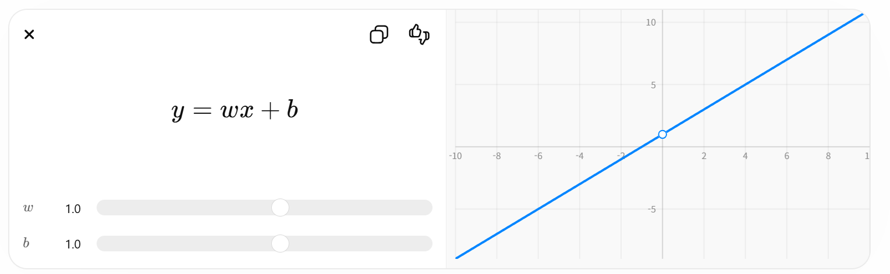

# 1. 머신러닝이란?

기존 프로그래밍 방식:

```text
입력 데이터 + 규칙(코드) → 결과
```

머신러닝 방식:

```text
입력 데이터 + 정답 → 학습 → 모델(규칙 생성)
새로운 데이터 → 모델 → 예측 결과
```

예시:

| 문제                | 입력                | 출력          |
| -----------------   | ------------------- | -----------   |
| 스팸 메일 분류      | 이메일 내용         | 스팸 여부     |
| 카드 이상 거래 탐지 | 거래 금액/시간/위치 | 정상/사기     |
| 집값 예측           | 면적/위치           | 예상 가격     |
| 이미지 분류         | 사진                | 고양이/강아지 |

---

# 2. 머신러닝의 핵심 목적

머신러닝의 목표는 다음 함수를 찾는 것입니다.

```text
입력(X) → 출력(Y)
```

예시:

| 입력(X)         | 출력(Y)        |
| --------------- | -------------- |
| 나이, 소득      | 대출 승인 여부 |
| 거래 시간, 금액 | fraud 여부     |
| 공부 시간       | 시험 점수      |

즉:

```text
Y = f(X)
```

를 데이터로부터 자동으로 찾는 과정입니다.

---

# 3. 머신러닝의 기본 구성 요소

## (1) 데이터(Data)

머신러닝의 가장 중요한 요소입니다.

예시 데이터:

| 나이 | 월급  | 대출 승인 |
| ---- | ----- | --------- |
| 25   | 300   | 승인      |
| 52   | 120   | 거절      |

구성:

* 입력값(Input, Feature, X)
* 정답(Label, Y)

---

## (2) Feature (특징)

모델이 학습하는 입력 정보입니다.

예시:

| 분야 | Feature              |
| ---- | -------------------- |
| 금융 | 거래금액, 시간, 위치 |
| 의료 | 혈압, 체온           |
| 쇼핑 | 구매횟수, 평균금액   |

금융 fraud 탐지 예시:

| 거래시간  | 금액    | 거리    | 결과  |
| --------- | ------- | ------- | ----- |
| 02:00     | 500만원 | 300km   | fraud |

---

## (3) Label (정답)

모델이 맞춰야 하는 값입니다.

예시:

| 문제         | Label          |
| ------------ | -------------- |
| 스팸 분류    | spam / normal  |
| fraud 탐지   | fraud / normal |
| 집값 예측    | 가격           |

---

## (4) 모델(Model)

데이터에서 규칙을 학습한 결과물입니다.

예시:

```text
"새벽 + 고액 + 먼 거리"
→ fraud 확률 높음
```

---

# 4. 머신러닝 학습 과정

전체 흐름:

```text
1. 데이터 수집
2. 데이터 전처리
3. Feature 생성
4. 모델 학습
5. 평가
6. 예측
7. 배포
```

---

# 5. 데이터 전처리(Preprocessing)

실무에서 가장 중요한 단계입니다.

데이터는 대부분 더럽습니다.

예시 문제:

| 문제           | 예시          |
| -----------    | ------------- |
| 결측치         | 나이 없음     |
| 이상치         | 금액 99999999 |
| 문자열 문제    | " Male "      |
| 날짜 형식 문제 | 2026/01/01    |

Pandas 활용 예시:

```python
# ==========================================
# 결측치(Null / NaN) 확인
# ==========================================

# 각 컬럼별로 결측치(NaN)가 몇 개인지 확인
df.isnull().sum()


# ==========================================
# 결측치 제거
# ==========================================

# 결측치가 하나라도 포함된 행(row)을 제거
# 주의:
# df.dropna()만 사용하면 원본 df는 변경되지 않음
# 결과를 다시 저장해야 적용됨
# df.dropna(inplace=True) 이와 같이 하면 원본 변경됨 더 짧음 
# 현재 pandas개발팀에서는 아래 코드를 더 추천함 
df = df.dropna()


# ==========================================
# 특정 컬럼의 결측치를 0으로 변경
# ==========================================

# amt 컬럼에 존재하는 NaN 값을 0으로 치환
# 예:
# NaN → 0
df["amt"] = df["amt"].fillna(0)
```

---

# 6. Feature Engineering (특징 공학)

Feature Engineering은 머신러닝 성능을 크게 좌우합니다.

단순히:

```text
"특징을 추가한다"
```

가 아니라,

```text
"모델이 학습하기 쉬운 형태로 문제를 변환한다"
```

가 Feature Engineering의 본질입니다.

---

## Feature Engineering의 특징 

```text
원본 데이터는 복잡함
→ Feature Engineering으로 의미별로 분리
→ 필요한 값끼리 비교 가능
→ 계산 단순화
→ 학습 효율 증가
→ 성능 향상
```

---

## 왜 원본 데이터는 비효율적인가?

예를 들어:

| 거래시간            |
| ------------------- |
| 2026-05-22 02:13:44 |

모델 입장에서는:

```text
2026-05-22 02:13:44
```

이 값 자체는 의미가 없습니다.

---

## Feature Engineering 적용

```python id="u86kl8"
df["hour"] = df["trans_date_trans_time"].dt.hour
```

결과:

| hour |
| ---- |
| 2    |

이제 모델은:

```text
새벽 2시 거래
```

패턴을 쉽게 비교할 수 있습니다.

---

## 핵심: 비교 가능한 형태로 변환

원본:

```text
"2026-05-22 02:13:44"
```

↓

변환:

```text
hour = 2
is_night = 1
```

즉:

```text
복잡한 데이터 → 비교 가능한 숫자 특징
```

로 변환하는 것입니다.

---

## Feature Engineering을 하면 계산이 빨라지는 이유

1. 차원 축소 효과
2. 모델의 탐색 범위 감소
3. 모델이 직접 계산할 필요 감소

### 1. 차원 축소 효과

원본 데이터:

```text
trans_date_trans_time
address
raw_text
gps
device_log
```

등은 매우 복잡합니다.

Feature Engineering 후:

```text
hour
distance
avg_amt
is_foreign
```

처럼 단순 숫자화됩니다.

즉:

```text
복잡한 고차원 데이터
→ 단순한 저차원 Feature
```

---

### 2. 모델의 탐색 범위 감소

예:

원본 문자열 (주소):

```text
"서울 강남구 ..."
```

보다(거리로 변환됨 단위(km))

```text
distance_from_home = 2.1
```

가 훨씬 학습하기 쉽습니다.

---

### 3. 모델이 직접 계산하지 않아 비교속도 빠름

원래는 모델이 내부적으로:

```text
"이 거래가 이상한가?"
```

를 스스로 찾아야 합니다.

하지만 Feature로:

```text
최근 1시간 거래 횟수
평균 대비 사용 비율
```

등을 넣어주면:

```text
모델이 복잡한 추론을 덜 해도 됨
```

---

## 왜 Feature Engineering을 해야하는지?

좋은 Feature는:

```text
복잡한 패턴을 미리 계산해주는 것
```

입니다.

즉:

```text
Feature Engineering =
사람이 도메인 지식으로
모델에게 힌트를 주는 과정
```

입니다.

---

## 예시 — 사기 탐지

원본 데이터:

| amt    | city  | time  |
| ------ | ----- | ----- |
| 900000 | Seoul | 02:13 |

이것만으로는 부족합니다.

---

## 좋은 Feature Engineering

```python id="v73vw5"
df["amt_ratio"] = df["amt"] / df["customer_avg_amt"]

df["is_night"] = (df["hour"] <= 5).astype(int)
```

이제 모델은:

```text
"평균보다 15배 큰 새벽 거래"
```

를 매우 쉽게 인식합니다.

---

## 결국 Feature는 "압축된 지식"

매우 중요한 개념입니다.

좋은 Feature는:

```text
원본 데이터의 의미를 압축한 것
```

입니다.

즉:

| 원본 데이터  | Feature        |
| ------------ | -------------- |
| GPS 좌표     | 집과 거리      |
| Timestamp    | 야간 여부      |
| 거래 목록    | 최근 거래 횟수 |
| 로그 문자열  | 에러 발생 수   |

---

## 딥러닝과 비교

딥러닝은 내부적으로 Feature를 자동 추출합니다.

예:

CNN:

```text
이미지
→ edge
→ shape
→ object
```

Transformer:

```text
문장
→ 의미 벡터
```

---

## 그런데 금융/표 데이터는 다름

Tabular Data에서는:

```text
사람이 만든 Feature
```

가 여전히 매우 강력합니다.

그래서:

* XGBoost
* LightGBM
* CatBoost

가 아직 금융권에서 강한 이유입니다.

---

## Feature Engineering으로 모델 결과에 대한 성능 차이 원인

좋은 Feature는:

### 1. 학습 난이도 감소

모델이 쉽게 패턴 발견

---

### 2. Noise 감소

불필요한 정보 제거

---

### 3. 계산량 감소

비교 단순화

---

### 4. 일반화 성능 증가

새 데이터에도 잘 동작

---

## 매우 중요한 머신러닝 관점

Feature Engineering은 사실:

```text
"문제를 쉽게 바꾸는 과정"
```

입니다.

좋은 ML 엔지니어는:

```text
모델 튜닝보다
문제 자체를 단순화
```

합니다.

---

## 한 줄 핵심 정리

```text
Feature Engineering은
원본 데이터를
비교/학습하기 쉬운 특징으로 변환하여

계산을 단순화하고
패턴 탐색을 쉽게 만들어
성능을 크게 향상시킨다.
```

입니다.

---

# 7. 머신러닝의 종류

1. 지도학습(Supervised Learning)
2. 비지도학습(Unsupervised Learning)
3. 강화학습(Reinforcement Learning)

---

## (1) 지도학습(Supervised Learning)

정답(Label)이 있는 데이터 학습

```text
입력(X) → 정답(Y)
```

예시:

| 입력      | 정답       |
| --------- | ---------- |
| 거래 정보 | fraud 여부 |

### 대표 알고리즘

| 알고리즘            | 특징          |
| ------------------- | -------       |
| Linear Regression   | 숫자 예측     |
| Logistic Regression | 분류          |
| Decision Tree       | 규칙 기반     |
| Random Forest       | 트리 앙상블   |
| XGBoost             | 고성능 부스팅 |
| SVM                 | 경계 분류     |
| Neural Network      | 복잡한 패턴   |

---

## (2) 비지도학습(Unsupervised Learning)

정답 없이 패턴 발견

예시:

* 고객 그룹 분류
* 이상 탐지
* 추천 시스템

### 대표 알고리즘

| 알고리즘  | 목적      |
| --------- | --------- |
| K-Means   | 군집화    |
| DBSCAN    | 밀도 기반 |
| PCA       | 차원 축소 |

---

## (3) 강화학습(Reinforcement Learning)

AI가 스스로 행동하면서 보상을 통해 배우는 방법을 강화학습(Reinforcement Learning) 이라고 합니다.

### 핵심 개념

```text
행동(Action) → 보상(Reward) → 학습(Learning)
```

AI는:

1. 어떤 행동을 해보고
2. 결과에 따라 보상을 받고
3. 더 좋은 보상을 얻는 방향으로 학습합니다.

---

### 예시

#### 강아지 훈련

강아지가 앉으면:

```text
앉기(행동)
→ 간식(보상)
→ "앉으면 좋은 일이 생기는구나" 학습
```

반대로 잘못 행동하면 보상이 없음

```text
점프함
→ 간식 없음
→ 점프는 좋은 행동이 아님 학습
```

---

#### 게임 AI 예시

게임 캐릭터가:

```text
오른쪽 이동
→ 점수 +10
→ 좋은 행동으로 학습
```

```text
적에게 공격당함
→ 점수 -50
→ 위험한 행동으로 학습
```

이 과정을 수천~수억 번 반복하면서
AI가 점점 더 똑똑해집니다.

---

#### DeepMind 의 AlphaGo

바둑을 두면서:

```text
좋은 수 → 보상
나쁜 수 → 패널티
```

를 반복 학습하여 인간 최고수를 이김

---

# 8. 분류(Classification) vs 회귀(Regression)

## 머신러닝(ML)에서 분류(Classification)란?

머신러닝의 **분류(Classification)** 는
입력된 데이터를 특정한 **카테고리(클래스)** 로 나누는 문제입니다.

즉:

> "이 데이터는 어떤 종류인가?"
> 를 예측하는 것입니다.

---

## 1. 가장 쉬운 예시

예를 들어 이메일이 있다고 가정합니다.

| 이메일 내용       | 결과      |
| ----------------- | --------- |
| "무료 쿠폰 지급!" | 스팸      |
| "회의 일정 공유"  | 정상 메일 |

머신러닝은 과거 데이터를 학습해서:

* 스팸인지
* 정상인지

자동으로 판단합니다.

이것이 바로 분류(Classification)입니다.

---

## 2. 분류의 핵심 구조

분류는 보통 아래 구조입니다.

```text
입력 데이터(X) → 모델 → 클래스(Y)
```

예시:

```text
신용카드 거래 정보 → AI 모델 → 정상 / 사기
```

---

## 3. 대표적인 분류 예시들

### (1) 스팸 메일 분류

입력:

```text
"당첨되었습니다!"
```

출력:

```text
스팸
```

---

### (2) 카드 사기 탐지

입력:

| 시간     | 금액    | 국가 |
| -------- | ------- | ---- |
| 새벽 3시 | 500만원 | 해외 |

출력:

```text
사기 거래
```

---

### (3) 이미지 분류

고양이/강아지 사진 구분

입력 이미지:

```text
이미지 픽셀 데이터
```

출력:

```text
고양이
```

또는

```text
강아지
```

---

### (4) 질병 진단

입력:

| 체온  | 혈압 | 혈당 |
| ----- | ---- | ---- |
| 39도  | 높음 | 높음 |

출력:

```text
당뇨 위험
```

---

## 4. 분류의 종류

### (1) 이진 분류(Binary Classification)

클래스가 2개

예시:

* 합격 / 불합격
* 정상 / 이상
* 스팸 / 정상

대표 예시:

```text
0 = 정상
1 = 사기
```

---

### (2) 다중 분류(Multi-class Classification)

클래스가 여러 개

예시:

* 고양이
* 강아지
* 토끼
* 새

---

### (3) 다중 레이블 분류(Multi-label Classification)

한 데이터가 여러 클래스를 동시에 가질 수 있음

예시:

영화 장르

```text
액션 + SF + 코미디
```

---

## 5. 분류 모델이 학습하는 원리

예를 들어 카드 사기를 학습한다고 가정합니다.

---

### 학습 데이터

| 거래금액  | 시간 | 해외여부 | 결과 |
| --------: | ---- | :------: | ---- |
| 10,000    | 오후 | X        | 정상 |
| 5,000,000 | 새벽 | O        | 사기 |

AI는 패턴을 학습합니다.

```text
고액 + 새벽 + 해외
→ 사기 가능성 높음
```

---

## 6. 분류에서 중요한 개념

### (1) Feature (특징)

모델이 참고하는 정보

예시:

| Feature   |
| --------- |
| 거래 금액 |
| 시간      |
| 국가      |
| IP        |
| 브라우저  |

---

## (2) Label (정답)

실제 결과

예시:

```text
정상
사기
```

---

## 7. 분류 모델 종류

대표 모델들:

| 모델                | 특징           |
| ------------------- | -------------- |
| Logistic Regression | 가장 기본      |
| Decision Tree       | 규칙 기반      |
| Random Forest       | 여러 트리 결합 |
| XGBoost             | 매우 강력      |
| SVM                 | 경계 분류      |
| Neural Network      | 딥러닝 기반    |
| CNN                 | 이미지 분류    |
| Transformer         | NLP 분류       |

---

## 8. Python 꽃(붓꽃) 예제 (Scikit-Learn) 

`seaborn.load_dataset("iris")`로 생성한 CSV는
꽃(붓꽃)의 특징(feature)을 저장한 머신러닝 대표 데이터셋입니다.

주로:

* 머신러닝 입문
* 분류(Classification)
* 데이터 시각화
* 통계 분석

실습에 가장 많이 사용됩니다.

---

### 전체 구조

| 컬럼명       | 의미            | 데이터 타입 |
| ------------ | --------------- | ----------- |
| sepal_length | 꽃받침 길이     | float       |
| sepal_width  | 꽃받침 너비     | float       |
| petal_length | 꽃잎 길이       | float       |
| petal_width  | 꽃잎 너비       | float       |
| species      | 꽃 품종(Label)  | string      |

---

### 예시 데이터

| sepal_length | sepal_width | petal_length | petal_width | species    |
| ------------ | ----------- | ------------ | ----------- | ---------- |
| 5.1          | 3.5         | 1.4          | 0.2         | setosa     |
| 7.0          | 3.2         | 4.7          | 1.4         | versicolor |
| 6.3          | 3.3         | 6.0          | 2.5         | virginica  |

---

### 1. sepal_length

꽃받침(Sepal)의 길이입니다.

단위:

```text id="p49jth"
cm (센티미터)
```

---

### 꽃받침(Sepal)이란?

꽃 바깥쪽을 감싸는 부분입니다.


---

### 예시

| 값  |
| --- |
| 5.1 |
| 6.7 |
| 7.2 |

의미:

```text id="jfwx5r"
꽃받침 길이가 5.1cm
```

---

### 2. sepal_width

꽃받침의 너비입니다.

단위:

```text id="8sykl7"
cm
```

---

### 예시

| 값  |
| --- |
| 3.5 |
| 2.8 |
| 3.2 |

의미:

```text id="5w1od0"
꽃받침 폭이 3.5cm
```

---

### 3. petal_length

꽃잎(Petal)의 길이입니다.


---

### 특징

Iris 데이터에서 가장 중요한 feature 중 하나입니다.

왜냐하면:

```text id="k6hm2y"
품종별 차이가 매우 큼
```

예시:

| species    | petal_length 평균 |
| ---------- | ----------------- |
| setosa     | 매우 짧음         |
| versicolor | 중간              |
| virginica  | 매우 김           |

---

### 4. petal_width

꽃잎의 너비입니다.

단위:

```text id="m8og09"
cm
```

---

### 특징

분류 정확도에 큰 영향을 줍니다.

예시:

| species   | petal_width 특징 |
| --------- | ---------------- |
| setosa    | 매우 얇음        |
| virginica | 매우 넓음        |

---

### 5. species (정답 Label)

이 컬럼이 머신러닝의 목표값(Target)입니다.

즉:

```text id="grq2n7"
AI가 맞춰야 하는 정답
```

입니다.

---

### species 종류

총 3개 품종이 있습니다.

| species    | 의미     |
| ---------- | -------- |
| setosa     | 세토사   |
| versicolor | 버시컬러 |
| virginica  | 버지니카 |

---

### 품종별 개수

| species    | 개수 |
| ---------- | ---: |
| setosa     | 50   |
| versicolor | 50   |
| virginica  | 50   |

즉:

```text id="8vsvx4"
균형 잡힌 데이터셋
```

입니다.

---

### 머신러닝 관점에서의 구조

입력(X):

| Feature      |
| ------------ |
| sepal_length |
| sepal_width  |
| petal_length |
| petal_width  |

출력(y):

| Label   |
| ------- |
| species |

---

### 실제 ML 동작 방식

예를 들어:

| petal_length | petal_width |
| ------------ | ----------- |
| 1.4          | 0.2         |

라면 AI는:

```text id="5v0mgw"
setosa 가능성이 매우 높음
```

이라고 판단합니다.

---

### 실제 시각화 예시

```python id="g4n0np"
import seaborn as sns
import matplotlib.pyplot as plt

df = sns.load_dataset("iris")

sns.scatterplot(
    data=df,
    x="petal_length",
    y="petal_width",
    hue="species"
)

plt.show()
```

그러면:

* setosa
* versicolor
* virginica

가 거의 군집처럼 분리되는 것을 볼 수 있습니다.

---

파일명 : scikit-learn-iris.py

```python
import pandas as pd
import seaborn as sns

from sklearn.model_selection import train_test_split
from sklearn.ensemble import RandomForestClassifier
from sklearn.metrics import accuracy_score

# ==========================================
# 1. seaborn 데이터 로드
# ==========================================

df = sns.load_dataset("iris")

print(df.head())

# ==========================================
# 2. CSV 저장
# ==========================================

df.to_csv(
    "iris.csv",
    index=False,
    encoding="utf-8-sig"
)

print("iris.csv 저장 완료")

# ==========================================
# 3. 입력(X) / 정답(y)
# ==========================================

# 정답 필드 삭제함  
X = df.drop("species", axis=1)

#정답 필드 
y = df["species"]

# ==========================================
# 4. 학습 / 테스트 분리
# ==========================================

X_train, X_test, y_train, y_test = train_test_split(
    X,
    y,
    test_size=0.2,
    random_state=42
)

# ==========================================
# 5. 모델 생성
# ==========================================

model = RandomForestClassifier()

# ==========================================
# 6. 모델 학습
# ==========================================

model.fit(X_train, y_train)

# ==========================================
# 7. 예측
# ==========================================

pred = model.predict(X_test)

# ==========================================
# 8. 정확도 평가
# ==========================================

acc = accuracy_score(y_test, pred)

print("정확도:", acc)

```


### 학습한 모델을 추론으로 사용 예

파일명 : 
```python
import pandas as pd
import seaborn as sns
import joblib

from sklearn.model_selection import train_test_split
from sklearn.ensemble import RandomForestClassifier
from sklearn.metrics import accuracy_score

# ==========================================
# 1. seaborn 데이터 로드
# ==========================================

df = sns.load_dataset("iris")

print(df.head())

# ==========================================
# 2. CSV 저장
# ==========================================

df.to_csv(
    "iris.csv",
    index=False,
    encoding="utf-8-sig"
)

print("iris.csv 저장 완료")

# ==========================================
# 3. 입력(X) / 정답(y)
# ==========================================

# 정답 필드 제거
X = df.drop("species", axis=1)

# 정답(Label)
y = df["species"]

# ==========================================
# 4. 학습 / 테스트 분리
# ==========================================

X_train, X_test, y_train, y_test = train_test_split(
    X,
    y,
    test_size=0.2,
    random_state=42
)

# ==========================================
# 5. 모델 생성
# ==========================================

model = RandomForestClassifier(
    random_state=42
)

# ==========================================
# 6. 모델 학습
# ==========================================

model.fit(X_train, y_train)

# ==========================================
# 7. 예측
# ==========================================

pred = model.predict(X_test)

# ==========================================
# 8. 정확도 평가
# ==========================================

acc = accuracy_score(y_test, pred)

print("정확도:", acc)

# ==========================================
# 9. 모델 저장
# ==========================================

joblib.dump(
    model,
    "iris_model.pkl"
)

print("모델 저장 완료 : iris_model.pkl")

# ==========================================
# 10. 저장된 모델 로드
# ==========================================

loaded_model = joblib.load(
    "iris_model.pkl"
)

print("모델 로드 완료")

# ==========================================
# 11. 새로운 데이터 추론(Inference)
# ==========================================

# 새로운 꽃 데이터
new_data = pd.DataFrame(
    [
        [5.1, 3.5, 1.4, 0.2]
    ],
    columns=[
        "sepal_length",
        "sepal_width",
        "petal_length",
        "petal_width"
    ]
)

# 예측
result = loaded_model.predict(new_data)

# 확률 예측
proba = loaded_model.predict_proba(new_data)

print("예측 결과 :", result[0])

print("예측 확률 :")
print(proba)
```

---

## 회귀

숫자 예측

예시:

* 집값
* 주식 가격
* 소비 금액

대표 알고리즘:

* Linear Regression
* Ridge
* Lasso

---

# 9. Overfitting (과적합)

훈련 데이터만 외워버리는 문제

예시:

```text
시험 문제 답만 암기
→ 응용 문제 못 품
```

징후:

| 상태              | 결과   |
| ----------------- | ----   |
| Train 정확도 높음 | GOOD   |
| Test 정확도 낮음  | 과적합 |

해결:

* 데이터 증가
* Feature 정리
* 정규화
* Dropout
* Cross Validation

---

# 10. 머신러닝 평가 지표

분류 모델은 단순히:

```text id="q4xw1y"
맞았다 / 틀렸다
```

만 보는 것이 아닙니다.

실제로는:

* 얼마나 정확한가?
* 사기를 잘 찾는가?
* 오탐(False Positive)이 많은가?
* 놓치는(False Negative) 경우가 많은가?

등을 종합적으로 평가해야 합니다.

그래서 아래 지표들을 사용합니다.

| 지표      | 의미                    |
| --------- | ----------------------- |
| Accuracy  | 전체 정확도             |
| Precision | 예측 신뢰도             |
| Recall    | 실제 탐지 능력          |
| F1-score  | Precision + Recall 균형 |
| ROC-AUC   | 전체 분류 성능          |

---

## 1. 먼저 가장 중요한 개념

분류 평가는 아래 4개가 핵심입니다.

| 실제값 | 예측값 | 의미                |
| ------ | ------ | ------------------- |
| 정상   | 정상   | True Negative (TN)  |
| 정상   | 사기   | False Positive (FP) |
| 사기   | 정상   | False Negative (FN) |
| 사기   | 사기   | True Positive (TP)  |

---

|           | 예측 정상 | 예측 사기 |
| --------- | :-------: | :-------: |
| 실제 정상 | TN        | FP        |
| 실제 사기 | FN        | TP        |

---

# 예시 데이터

예를 들어:

| 실제 | 예측 |
| ---- | ---- |
| 정상 | 정상 |
| 정상 | 정상 |
| 사기 | 사기 |
| 사기 | 정상 |

결과:

| 항목 | 개수 |
| :--: | ---: |
| TP   | 1  |
| TN   | 2  |
| FP   | 0  |
| FN   | 1  |

---

# 2. Accuracy (정확도)

가장 기본적인 평가 지표입니다.

의미:

```text id="w3s4y2"
전체 중 얼마나 맞췄는가
```

---

## 공식
$$
Accuracy = \frac{TP + TN}{TP + TN + FP + FN}
$$
---

# 예시

| 전체 데이터 | 100개 |
| ----------- | ----- |
| 맞춘 개수   | 95개  |

정확도:

```text id="v6ux9p"
95%
```

---

# Accuracy의 문제점

정확도는 데이터 불균형에서 위험합니다.

---

## 예시: 카드 사기 탐지

| 데이터    | 개수 |
| --------- | ---: |
| 정상 거래 | 990  |
| 사기 거래 | 10   |

만약 모델이:

```text id="h8tw9p"
전부 정상이라고 예측
```

하면?

정확도:

$$
Accuracy = \frac{990}{1000}=99%
$$

엄청 높아 보입니다.

하지만:

```text id="vjlwmr"
사기를 하나도 못 찾음
```

즉:

```text id="oqgx3m"
Accuracy만 보면 위험
```

합니다.

---

# 3. Precision (정밀도)

의미:

```text id="iq8j1r"
사기라고 예측한 것 중 진짜 사기의 비율
```

---

## 공식

$$
Precision = \frac{TP}{TP + FP}
$$

---

# 예시

모델이:

```text id="qj4l0r"
10건을 사기라고 판단
```

했는데:

* 실제 사기 = 8
* 정상인데 잘못 탐지 = 2

라면:

$$
Precision = \frac{8}{10}=0.8
$$

즉:

```text id="cjlwm7"
정밀도 80%
```

---

# Precision이 중요한 분야

| 분야      | 이유                 |
| --------- | -------------------- |
| 스팸 메일 | 정상 메일 차단 위험  |
| 의료      | 정상 환자 오진 위험  |
| 법률      | 무고한 사람 오탐 위험 |

---

# Precision 높다는 의미

```text id="7g0gvl"
모델이 사기라고 하면 대체로 진짜 사기
```

라는 뜻입니다.

---

# 4. Recall (재현율)

의미:

```text id="q6dnmw"
실제 사기를 얼마나 잘 찾았는가
```

---

## 공식

$$
Recall = \frac{TP}{TP + FN}
$$

---

# 예시

실제 사기 100건 중:

* 90건 탐지 성공
* 10건 놓침

이면:

$$
Recall = \frac{90}{100}=0.9
$$

즉:

```text id="rjlwm9"
재현율 90%
```

---

# Recall이 중요한 분야

| 분야      | 이유             |
| --------- | ---------------- |
| 암 진단   | 놓치면 위험      |
| 금융 사기 | 탐지 실패 위험   |
| 침입 탐지 | 해킹 놓치면 위험 |

---

# Recall 높다는 의미

```text id="gmn8kp"
실제 위험 데이터를 잘 찾아냄
```

입니다.

---

# 5. Precision vs Recall

이 둘은 서로 트레이드오프 관계입니다.

---

# 예시

## Precision 높이기

매우 확실한 것만 사기 판정

결과:

* 오탐 감소
* 하지만 사기 놓침 증가

즉:

```text id="njlwm2"
Precision ↑
Recall ↓
```

---

## Recall 높이기

의심되면 전부 사기 처리

결과:

* 사기 잘 탐지
* 정상도 많이 오탐

즉:

```text id="djlwm8"
Recall ↑
Precision ↓
```

---

# 6. F1-score

Precision과 Recall의 균형 점수입니다.

의미:

```text id="n7mw3d"
Precision과 Recall을 동시에 고려
```

합니다.

---

## 공식

$$
F1 = 2 \times \frac{Precision \times Recall}{Precision + Recall}
$$

---

# 특징

| 특징                 | 의미           |
| -------------------- | -------------- |
| 둘 다 높아야 좋음    | 균형 중요      |
| 불균형 데이터에 강함 | 실무 많이 사용 |

---

# 예시

| Precision | Recall |
| --------: | -----: |
| 0.9       | 0.9    |

→ F1 높음

---

| Precision | Recall |
| --------- | ------ |
| 0.99      | 0.1    |

→ F1 낮음

---

# F1-score가 중요한 분야

| 분야      |
| --------- |
| 금융 사기 |
| 보안 탐지 |
| 의료 AI   |
| 이상 탐지 |

---

# 7. ROC-AUC

ROC-AUC는 머신러닝 분류(Classification)에서 가장 중요한 평가 지표 중 하나입니다.

특히:

* 금융 사기 탐지
* 의료 AI
* 이상 탐지
* 보안 시스템

같은 분야에서 매우 많이 사용됩니다.

---

# 1. ROC-AUC란?

ROC-AUC는 두 개로 구성됩니다.

| 용어  | 의미                              |
| ----- | --------------------------------- |
| ROC   | Receiver Operating Characteristic |
| AUC   | Area Under Curve                  |

즉:

```text id="o8jlwm"
ROC 곡선 아래 면적(AUC)
```

입니다.

---

# 핵심 의미

ROC-AUC는:

```text id="jlwmx1"
모델이
정상과 이상을
얼마나 잘 구분하는가
```

를 평가합니다.

---

# 2. 왜 ROC-AUC가 중요한가?

Accuracy는 문제가 있습니다.

예시:

| 정상 | 990 |
| ---- | --- |
| 사기 | 10  |

모두 정상이라고 예측하면:

$$
Accuracy = \frac{990}{1000}=99%
$$

엄청 좋아 보입니다.

하지만 실제로는:

```text id="jlwmx2"
사기를 하나도 못 찾음
```

입니다.

---

ROC-AUC는 이런 문제를 해결합니다.

즉:

```text id="jlwmx3"
전체 분류 능력을 평가
```

합니다.

---

# 3. ROC의 핵심 개념

ROC는 아래 두 값을 비교합니다.

| 항목  | 의미                |
| ----- | ------------------- |
| TPR   | True Positive Rate  |
| FPR   | False Positive Rate |

---

# 4. TPR (True Positive Rate)

다른 이름:

```text id="jlwmx4"
Recall
Sensitivity
```

---

## 의미

```text id="jlwmx5"
실제 Positive를 얼마나 잘 찾았는가
```

---

## 공식

$$
TPR = \frac{TP}{TP+FN}
$$

---

# 예시

실제 사기 100개 중:

* 90개 탐지 성공
* 10개 놓침

이면:

$$
TPR = \frac{90}{100}=0.9
$$

즉:

```text id="jlwmx6"
재현율 90%
```

---

# 5. FPR (False Positive Rate)

의미:

```text id="jlwmx7"
정상인데
잘못 Positive로 판단한 비율
```

---

## 공식

$$
FPR = \frac{FP}{FP+TN}
$$

---

# 예시

정상 1000건 중:

$$
* 50건 잘못 사기로 탐지
$$

이면:

$$
FPR = \frac{50}{1000}=0.05
$$

즉:

```text id="jlwmx8"
오탐률 5%
```

---

# 6. ROC Curve란?

ROC Curve는:

```text id="jlwmx9"
FPR(x축)
vs
TPR(y축)
```

그래프입니다.


---

# 축 의미

| 축  | 의미 |
| --- | ---- |
| X축 | FPR  |
| Y축 | TPR  |

---

# 좋은 모델은?

좋은 모델은:

```text id="jlwmxa"
FPR은 낮고
TPR은 높음
```

입니다.

즉:

```text id="jlwmxb"
왼쪽 위로 붙을수록 좋음
```

입니다.

---

# 7. Threshold(임계값) 개념

ROC의 핵심은:

```text id="jlwmxc"
Threshold를 계속 바꾸면서 평가
```

한다는 것입니다.

---

# 예시

모델 출력:

| 데이터 | 사기 확률 |
| :----: | --------: |
| A      | 0.95      |
| B      | 0.70      |
| C      | 0.40      |

---

## Threshold = 0.5

```text id="jlwmxd"
0.5 이상 → 사기
```

결과:

* A = 사기
* B = 사기
* C = 정상

---

## Threshold = 0.8

```text id="jlwmxe"
0.8 이상만 사기
```

결과:

* A = 사기
* B = 정상
* C = 정상

---

# Threshold를 바꾸면?

| 변화           | 결과           |
| -------------- | -------------- |
| Threshold 낮춤 | Recall 증가    |
| Threshold 낮춤 | FP 증가        |
| Threshold 높임 | Precision 증가 |
| Threshold 높임 | Recall 감소    |

ROC는 이 모든 상황을 평가합니다.

---

# 8. AUC란?

AUC는:

```text id="jlwmxf"
ROC 곡선 아래 면적
```

입니다.

---

# AUC 범위

| 값   | 의미      |
| ---- | -------   |
| 1.0  | 완벽      |
| 0.95 | 매우 우수 |
| 0.8  | 좋은 모델 |
| 0.7  | 보통      |
| 0.5  | 랜덤      |

---

# 왜 0.5가 랜덤인가?

랜덤 예측은 아래 대각선과 비슷합니다.


즉:

```text id="jlwmxg"
동전 던지기 수준
```

입니다.

---

# 9. ROC-AUC 직관적 의미

AUC는:

```text id="jlwmxh"
Positive 샘플이
Negative보다 높은 점수를 받을 확률
```

입니다.

---

# 예시

AUC = 0.95

의미:

```text id="jlwmxi"
95% 확률로
사기 데이터를 정상보다
더 높은 점수로 평가
```

한다는 뜻입니다.

---

# 10. 실무에서 ROC-AUC가 강력한 이유

Accuracy는:

```text id="jlwmxj"
Threshold 하나 기준
```

입니다.

하지만 ROC-AUC는:

```text id="jlwmxk"
모든 Threshold를 종합 평가
```

합니다.

그래서:

* 데이터 불균형
* Threshold 변화
* 운영 환경 변경

에 강합니다.

---

# 11. 실제 금융 AI 예시

카드 사기 탐지:

| 상황                  | 중요           |
| --------------------- | -------------- |
| 사기 놓치면 피해 큼   | Recall 중요    |
| 정상 차단 많으면 불편 | Precision 중요 |

ROC-AUC는:

```text id="jlwmxl"
이 둘을 전체적으로 평가
```

합니다.

---

# 12. 대표 머신러닝 알고리즘 설명

## (1) Linear Regression

직선으로 예측



예시:

```text
공부 시간 ↑ → 점수 ↑
```

---

## (2) Logistic Regression

확률 기반 분류

$$
P(y=1)=\frac{1}{1+e^{-z}}
$$

예시:

```text
fraud 확률 = 0.92
```

---

## (3) Decision Tree

질문 기반 분기

```text
금액 > 100만원?
 ├─ YES → 새벽 거래?
 │      ├─ YES → fraud
 │      └─ NO
 └─ NO → normal
```

장점:

* 해석 쉬움
* 시각화 가능

---

## (4) Random Forest

여러 개의 트리를 조합

```text
트리 100개 투표
```

장점:

* 정확도 높음
* 과적합 감소

---

## (5) XGBoost

현재 실무 최고 수준의 트리 기반 알고리즘 중 하나

특징:

* 빠름
* 정확도 높음
* Kaggle 우승 모델 다수

금융 fraud 탐지에서 매우 많이 사용됩니다.

---

## (6) Neural Network (딥러닝)

인간 신경망 구조 모방

구조:

```text
입력층 → 은닉층 → 출력층
```

활용:

* 이미지
* 음성
* LLM
* 자율주행

---

# 13. 딥러닝 vs 머신러닝

| 구분           | 머신러닝    | 딥러닝           |
| -------------- | ----------- | ---------------- |
| Feature 생성   | 사람이 함   | 자동 학습        |
| 데이터량       | 적어도 가능 | 많이 필요        |
| 연산량         | 낮음        | GPU 필요         |
| 대표 알고리즘  | XGBoost     | CNN, Transformer |

---

# 14. 금융 데이터에서 머신러닝

## fraud 탐지 예시

입력 Feature:

| Feature  | 의미           |
| -------- | ------------   |
| amt      | 거래금액       |
| hour     | 거래시간       |
| city_pop | 도시 인구      |
| distance | 이전 위치 거리 |

출력:

```text
0 = 정상
1 = fraud
```

모델이 학습하는 패턴:

```text
새벽 + 고액 + 먼 거리 + 짧은 시간
→ fraud 가능성 높음
```

---

# 15. 머신러닝 실무 전체 흐름

실무에서는 보통 아래 구조입니다.

```text
데이터 수집
↓
Pandas 분석
↓
Feature Engineering
↓
Train/Test 분리
↓
모델 학습
↓
평가
↓
튜닝
↓
배포(API)
↓
모니터링
```

* Pandas → 데이터 분석
* Scikit-Learn → 머신러닝
* FastAPI → 모델 API
* Docker → 컨테이너화
* Kubernetes → 운영 배포
* Prometheus/Grafana → 모니터링

이 흐름이 실제 MLOps 구조입니다.

---

# 16. Python 머신러닝 기본 예제

Scikit-Learn 사용:

```python
import pandas as pd
from sklearn.model_selection import train_test_split
from sklearn.ensemble import RandomForestClassifier
from sklearn.metrics import classification_report

# 데이터 로드
df = pd.read_csv("credit_card_transactions.csv")

# Feature / Label
X = df[["amt", "hour"]]
y = df["is_fraud"]

# 데이터 분리
X_train, X_test, y_train, y_test = train_test_split(
    X, y,
    test_size=0.2,
    random_state=42
)

# 모델 생성
model = RandomForestClassifier()

# 학습
model.fit(X_train, y_train)

# 예측
pred = model.predict(X_test)

# 평가
print(classification_report(y_test, pred))
```

---


