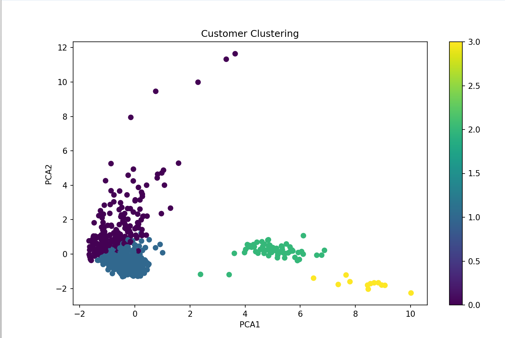
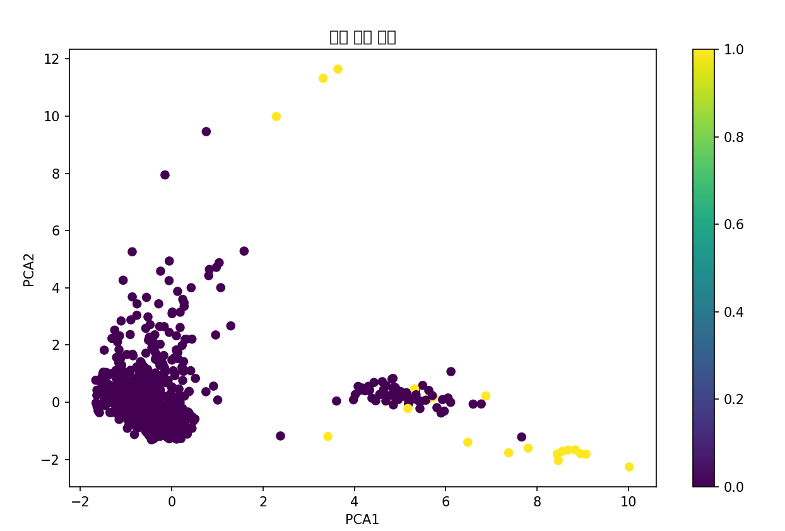

# 비지도학습(Unsupervised Learning)이란?

비지도학습은 **정답(Label)이 없는 데이터**에서
데이터의 **숨겨진 패턴, 구조, 관계**를 스스로 찾는 머신러닝 방법입니다.

즉,

* 지도학습 → "정답을 알려주고 학습"
* 비지도학습 → "정답 없이 데이터 스스로 구조 발견"

이라는 차이가 있습니다.

---

# 1. 지도학습 vs 비지도학습

| 구분        | 지도학습       | 비지도학습       |
| ----------- | -------------- | ---------------- |
| 정답(Label) | 있음           | 없음             |
| 목적        | 예측           | 구조 발견        |
| 예시        | 사기 거래 예측 | 고객 그룹 찾기   |
| 알고리즘    | 회귀, 분류     | 군집화, 차원축소 |
| 결과        | 정확도 중심    | 패턴 분석 중심   |

---

# 2. 비지도학습의 핵심 목적

비지도학습은 다음과 같은 목적을 가집니다.

1. 데이터 그룹 찾기 (군집화)
2. 이상 데이터 탐지
3. 데이터 압축 및 시각화

---

## 1. 데이터 그룹 찾기 (군집화)

비슷한 데이터끼리 자동 분류

예:

* 소비 패턴이 비슷한 고객 그룹
* 유사한 상품 그룹
* 유사한 문서 그룹

---

## 2. 이상 데이터 탐지

일반 패턴과 다른 데이터를 찾음

예:

* 금융 이상 거래 탐지
* 네트워크 침입 탐지
* 센서 고장 탐지

---

## 3. 데이터 압축 및 시각화

복잡한 데이터를 단순화

예:

* 수백 개 변수 → 2차원 축소
* 이미지 압축
* 특징 추출

---

# 3. 비지도학습의 대표 알고리즘

---

## 1. 군집화(Clustering)

가장 대표적인 비지도학습입니다.

비슷한 데이터끼리 묶습니다.

---

## K-Means

대표적인 군집화 알고리즘

원리:

1. 중심점(Centroid) 생성
2. 가장 가까운 중심으로 데이터 배정
3. 중심 업데이트
4. 반복

---

## 예시

고객 데이터:

| 고객 | 월 소비 | 거래 횟수 |
| ---- | ------- | --------- |
| A    | 10만원  | 3회       |
| B    | 12만원  | 4회       |
| C    | 300만원 | 40회      |

자동으로:

* 소액 소비 그룹
* 고액 소비 그룹

으로 나눔

---

## K-Means 특징

| 장점             | 단점              |
| ---------------- | ----------------- |
| 빠름             | 군집 개수(K) 필요 |
| 구현 쉬움        | 이상치에 약함     |
| 대규모 처리 가능 | 원형 군집에 적합  |

---

## K-Means 수식

각 데이터와 중심점 거리 최소화

$$
J=\sum_{i=1}^{k}\sum_{x\in C_i}||x-\mu_i||^2
$$

* (C_i): 군집
* (\mu_i): 중심점

---

## 2. 계층적 군집화(Hierarchical Clustering)

트리 구조로 군집 생성

---

## 특징

* 덴드로그램(Dendrogram) 생성
* 군집 개수 자동 탐색 가능

---

## 방식

### Bottom-Up (Agglomerative)

작은 군집 → 큰 군집

### Top-Down (Divisive)

큰 군집 → 작은 군집

---

## 금융 예시

카드 사용자:

* 야간 소비형
* 주말 소비형
* 고액 결제형
* 해외 사용형

등으로 계층 구조 분석 가능

---

## 3. DBSCAN

밀도 기반 군집화

---

## 특징

* 이상치 탐지 가능
* 군집 개수 자동 결정
* 복잡한 형태 군집 가능

---

## 금융 분야 활용

정상 거래 밀집 영역에서 벗어난 거래 탐지

예:

* 갑자기 해외 고액 결제
* 평소와 다른 지역 사용

---

# 4. 차원 축소(Dimensionality Reduction)

데이터 특징(Feature)이 너무 많을 때 축소

---

# PCA(주성분 분석)

가장 중요한 축만 남김

---

## 목적

100개 변수 → 핵심 2~3개 변수

---

## 예시

금융 데이터:

* 거래시간
* 거래금액
* 위치
* 업종
* 카드 종류
* 연령

↓

핵심 소비 패턴 축 생성

---

## PCA 핵심 개념

분산이 가장 큰 방향을 찾음
$$
\text{PC}_1 = w_1x_1 + w_2x_2 + \cdots + w_nx_n
$$
---

# 5. 이상 탐지(Anomaly Detection)

정상 패턴과 다른 데이터를 찾는 기술

금융 AI에서 매우 중요합니다.

---

# 금융 이상거래 예시

| 정상 패턴  | 이상 패턴        |
| ---------- | ---------------- |
| 서울 사용  | 갑자기 해외 사용 |
| 하루 3회   | 하루 100회       |
| 평균 5만원 | 갑자기 500만원   |

---

# 대표 알고리즘

## Isolation Forest

이상치는 쉽게 분리된다는 개념

특징:

* 대용량 처리 가능
* 금융 사기 탐지에 많이 사용

---

## One-Class SVM

정상 데이터 경계 학습

경계를 벗어나면 이상 판단

---

# 6. 추천 시스템과 비지도학습

유사 사용자 분석

예:

* Netflix 추천
* 쿠팡 상품 추천
* 금융 상품 추천

---

## 협업 필터링(Collaborative Filtering)

비슷한 사용자 찾기

예:

* A와 B가 소비 패턴 유사
* A가 가입한 금융 상품 추천

---

# 7. 생성형 AI와 비지도학습 관계

최근 LLM(대규모 언어모델)도
비지도/자기지도학습(Self-Supervised Learning) 기반입니다.

예:

* 다음 단어 예측
* 문장 구조 학습
* 언어 패턴 학습

대표 모델:

* OpenAI 의 GPT
* Google 의 Gemini
* Meta 의 LLaMA

---

# 8. 금융 AI에서 비지도학습 활용

## 금융 비지도학습 활용 사례

| 분야           | 활용               |
| -------------- | ------------       |
| 이상 거래 탐지 | 사기 패턴 발견     |
| 고객 세분화    | VIP/일반 고객 분리 |
| 소비 패턴 분석 | 소비 성향 분석     |
| 리스크 탐지    | 비정상 행위 탐지   |
| AML            | 자금세탁 탐지      |

---

# 9. 실제 금융 데이터 분석 흐름

예: `credit_card_transactions.csv`

---

## Step 1. Feature 생성

예:

| Feature           | 의미           |
| ----------------- | -------------- |
| transaction_count | 거래 횟수      |
| avg_amount        | 평균 결제 금액 |
| std_amount        | 소비 변동성    |
| night_ratio       | 야간 사용 비율 |
| weekend_ratio     | 주말 사용 비율 |

---

## Step 2. 정규화

비지도학습은 거리 기반 알고리즘이 많음

따라서 스케일링 중요

```python
from sklearn.preprocessing import StandardScaler

# 평균=0, 표준편차=1 형태로 변환
# 거리 기반 알고리즘(KMeans)에 중요
# 각 컬럼의 평균 계산
# 각 컬럼의 표준편차 계산
# 이후 데이터를 변환할 준비를 수행하는 객체입니다.
scaler = StandardScaler()
```

데이터 정규화 수행
먼저 데이터의 통계를 계산합니다.

| feature | 평균 | 표준편차 |
| ------- | ---: | -------: |
| 나이    |   35 |       10 |
| 급여    | 5000 |     2000 |

표준화 공식 : $$ z = \frac{x-\mu}{\sigma} $$
$$
x = 원래 값, μ = 평균, σ = 표준편차
$$

원본 데이터:

| 나이 | 급여   |
| ---  | ------ |
| 20   | 3000   |
| 30   | 5000   |
| 40   | 7000   |

표준화 후:

| 나이_scaled | 급여_scaled  |
| ----------  | ------------ |
| -1.22       | -1.22        |
| 0           | 0            |
| 1.22        | 1.22         |

스케일링 후 모든 컬럼이 비슷한 범위가 됩니다.

| feature      | 범위   |
| ------------ | ------ |
| 나이_scaled  | -2 ~ 2 |
| 급여_scaled  | -2 ~ 2 |

```python
X_scaled = scaler.fit_transform(customer_behavior)
```

---

## Step 3. 군집화

```python
from sklearn.cluster import KMeans

kmeans = KMeans(n_clusters=4)
clusters = kmeans.fit_predict(X_scaled)
```

---

## Step 4. 고객 그룹 분석

예:

| Cluster | 특징           |
| ------- | -------------- |
| 0       | 일반 소비자    |
| 1       | VIP            |
| 2       | 야간 소비형    |
| 3       | 이상 소비 패턴 |

## Step 5. PCA 차원축소

고차원 데이터를 2차원으로 압축

시각화 가능하게 만듭니다.

| PCA 축 | 의미 추정   |
| ------ | ----------- |
| PCA1   | 소비 규모   |
| PCA2   | 소비 변동성 |

## credit_card_transactions.csv 데이터를 4개의 고객 그룹으로 분류하는 프로그램 

파일명 : kmeans.py

```python
import pandas as pd
import numpy as np
import matplotlib.pyplot as plt

# 데이터 정규화
from sklearn.preprocessing import StandardScaler

# 군집화 알고리즘
from sklearn.cluster import KMeans

# 차원 축소
from sklearn.decomposition import PCA

# 이상 탐지 모델
from sklearn.ensemble import IsolationForest


# =========================================
# 1. 데이터 로드
# =========================================

# CSV 파일 읽기
df = pd.read_csv("data/credit_card_transactions.csv")

# 상위 5개 데이터 출력
print(df.head())

# 데이터 구조 및 타입 확인
print(df.info())


# =========================================
# 2. 날짜 변환
# =========================================

# 문자열 형태의 날짜 데이터를 datetime 타입으로 변환
df["trans_date_trans_time"] = pd.to_datetime(
    df["trans_date_trans_time"]
)

# 거래 시간(hour) 추출
df["hour"] = df["trans_date_trans_time"].dt.hour

# 요일 추출
# 월요일=0 ~ 일요일=6
df["dayofweek"] = df["trans_date_trans_time"].dt.dayofweek


# =========================================
# 3. Feature Engineering
# =========================================

# 야간 거래 여부 생성
# 22시~05시는 1
# 나머지는 0
df["night_transaction"] = df["hour"].apply(
    lambda x: 1 if (x >= 22 or x <= 5) else 0
)

# 주말 거래 여부 생성
# 토요일(5), 일요일(6)은 1
df["weekend"] = df["dayofweek"].apply(
    lambda x: 1 if x >= 5 else 0
)


# =========================================
# 4. 고객별 행동 패턴 생성
# =========================================

# 고객 카드 번호(cc_num) 기준으로 그룹화
customer_behavior = df.groupby("cc_num").agg({

    # 거래 금액 통계 생성
    "amt": [

        # 총 거래 건수
        "count",

        # 평균 거래 금액
        "mean",

        # 거래 금액 표준편차
        # 값이 크면 소비 패턴 변화가 큼
        "std",

        # 최대 거래 금액
        "max",

        # 최소 거래 금액
        "min"
    ],

    # 야간 거래 비율
    # 0~1 사이 값
    "night_transaction": "mean",

    # 주말 거래 비율
    "weekend": "mean",

    # 도시 인구 평균
    # 고객이 주로 거래한 지역 규모 분석 가능
    "city_pop": "mean"

})

# MultiIndex 컬럼명을 단순화
customer_behavior.columns = [

    "transaction_count",  # 거래 건수
    "avg_amount",         # 평균 거래 금액
    "std_amount",         # 거래 금액 표준편차
    "max_amount",         # 최대 거래 금액
    "min_amount",         # 최소 거래 금액
    "night_ratio",        # 야간 거래 비율
    "weekend_ratio",      # 주말 거래 비율
    "avg_city_pop"        # 평균 도시 인구

]

# 결측치(NaN) 제거
# std는 거래가 1건이면 NaN 발생 가능
customer_behavior = customer_behavior.fillna(0)

# 생성된 고객 행동 데이터 확인
print(customer_behavior.head())


# =========================================
# 5. 정규화
# =========================================

# 평균=0, 표준편차=1 형태로 변환
# 거리 기반 알고리즘(KMeans)에 중요
# 각 컬럼의 평균 계산
# 각 컬럼의 표준편차 계산
# 이후 데이터를 변환할 준비를 수행하는 객체입니다.
scaler = StandardScaler()

# 데이터 정규화 수행
# 먼저 데이터의 통계를 계산합니다.
# | feature | 평균 | 표준편차 |
# | ------- | ---: | -------: |
# | 나이    |   35 |       10 |
# | 급여    | 5000 |     2000 |

# 표준화 공식 : z = (x-u)/σ 
# x = 원래 값
# μ = 평균
# σ = 표준편차

# 원본 데이터:
# | 나이 | 급여 |
# | --- | ------ |
# | 20  | 3000   |
# | 30  | 5000   |
# | 40  | 7000   |

# 표준화 후:
# | 나이_scaled | 급여_scaled |
# | ---------- | ------------- |
# | -1.22      | -1.22         |
# | 0          | 0             |
# | 1.22       | 1.22          |

# 스케일링 후 모든 컬럼이 비슷한 범위가 됩니다. 
# | feature      | 범위   |
# | ------------ | ------ |
# | 나이_scaled  | -2 ~ 2 |
# | 급여_scaled  | -2 ~ 2 |

X_scaled = scaler.fit_transform(customer_behavior)
print(X_scaled)

# =========================================
# 6. K-Means 군집화
# =========================================

# 고객을 4개 그룹으로 분류
kmeans = KMeans(
    n_clusters=4,
    random_state=42
)

# 군집 예측 수행
customer_behavior["cluster"] = kmeans.fit_predict(X_scaled)
# 군집별 고객 수 출력
print(customer_behavior["cluster"].value_counts())


# =========================================
# 7. PCA 차원 축소
# =========================================

# 고차원 데이터를 2차원으로 축소
# 시각화 목적
pca = PCA(n_components=2)

# PCA 적용
X_pca = pca.fit_transform(X_scaled)

# PCA 결과 저장
customer_behavior["pca1"] = X_pca[:, 0]
customer_behavior["pca2"] = X_pca[:, 1]

#| PCA 축 | 의미 추정   |
#| ------ | ----------  |
#| PCA1   | 소비 규모   |
#| PCA2   | 소비 변동성 |


# =========================================
# 8. 군집 시각화
# =========================================

plt.figure(figsize=(10, 6))

# PCA 결과를 scatter plot으로 시각화
# 색상은 cluster 값 사용
scatter = plt.scatter(
    customer_behavior["pca1"],
    customer_behavior["pca2"],
    c=customer_behavior["cluster"]
)

plt.title("Customer Clustering")

plt.xlabel("PCA1")
plt.ylabel("PCA2")

# 색상 범례 표시
plt.colorbar(scatter)

plt.show()


```

## 결과 그래프



### 보라색 그룹 (cluster 0)

왼쪽 위에 퍼져 있음.

특징:

* PCA2 값이 큼
* 거래 패턴 변동성이 큼
* 일부는 매우 위쪽(outlier)

가능한 의미:

* 거래 패턴이 불규칙
* 거래 금액 편차 큼
* 야간 거래 많을 가능성
* 위험 고객 후보

특히:

```text
PCA2 = 8~12
```

근처 점들은 매우 특이한 고객입니다.

즉:

* 초고액 거래
* 비정상 소비 패턴
* 사기 가능성

일 수도 있음.

---

### 파란색 그룹 (cluster 1)

왼쪽 아래에 밀집.

이 그룹이 가장 "일반적인 고객"일 가능성이 큽니다.

특징:

* 평균적 소비
* 거래 패턴 안정적
* 거래 금액 변동 적음
* 정상 고객 가능성 높음

보통 실제 금융 데이터에서:

```text
정상 고객
```

이 가장 큰 군집을 형성합니다.

---

### 초록색 그룹 (cluster 2)

오른쪽 중간.

특징:

* PCA1 값 큼
* 다른 고객과 분리됨

가능성:

* 거래 횟수가 많음
* 특정 소비 성향 존재
* VIP 고객
* 고액 소비층

일 수 있습니다.

---

### 노란색 그룹 (cluster 3)

오른쪽 아래.

가장 특이한 그룹.

특징:

* 다른 군집과 매우 멀리 떨어짐
* 소수만 존재

이건 실무에서 매우 중요합니다.

보통:

* 이상 거래
* 사기 가능성
* 비정상 소비
* 극단적 패턴

일 가능성이 큼.

---

# 왜 떨어져 있으면 중요한가?

KMeans 는 거리 기반입니다.

즉:

```text
멀리 떨어진 고객 = 행동 패턴이 다름
```

을 의미합니다.

---

# 실무 관점 해석

현재 데이터는 거의 확실히 아래처럼 해석 가능합니다.

| 군집      | 의미             |
| --------- | ---------------- |
| cluster 1 | 일반 고객        |
| cluster 0 | 변동성 높은 고객 |
| cluster 2 | 고액/VIP 고객    |
| cluster 3 | 이상 행동 고객   |

---

# 현재 그래프에서 가장 중요한 점

```text
군집 분리가 꽤 잘 됨
```

을 의미합니다.

즉:

* 고객 유형이 실제로 다르게 존재
* Feature Engineering이 잘 되었음
* StandardScaler 효과 있음
* PCA 시각화 성공

이라는 의미입니다.

---

## Step 6. Isolation Forest

금융 이상거래 탐지 핵심 알고리즘 중 하나입니다.

원리:

* 정상 고객은 밀집
* 이상 고객은 고립

따라서:

* 쉽게 분리되면 이상치

---

## 정상 고객 특징

```text
- 평균 소비 패턴 존재
- 일정한 거래 횟수
- 일반 시간대 사용
```

---

## 이상 고객 특징

```text
- 갑자기 큰 금액 사용
- 야간 사용 비율 높음
- 거래 횟수 급증
- 소비 편차 매우 큼
```

---

## 전체 분석 흐름

```text
1. 데이터 로드
2. 전처리
3. Feature Engineering
4. 고객별 행동 패턴 생성
5. 정규화
6. K-Means 고객 군집화
7. PCA 시각화
8. Isolation Forest 이상탐지
9. 이상 거래 고객 분석
```

---

## 전체 코드

파일명 : kmeans2.py

```python
import pandas as pd
import numpy as np
import matplotlib.pyplot as plt

from sklearn.preprocessing import StandardScaler
from sklearn.cluster import KMeans
from sklearn.decomposition import PCA
from sklearn.ensemble import IsolationForest

# =========================================
# 1. 데이터 로드
# =========================================

df = pd.read_csv("data/credit_card_transactions.csv")

print(df.head())
print(df.info())

# =========================================
# 2. 날짜 변환
# =========================================

df["trans_date_trans_time"] = pd.to_datetime(
    df["trans_date_trans_time"]
)

# 시간 파생 변수 생성
df["hour"] = df["trans_date_trans_time"].dt.hour
df["dayofweek"] = df["trans_date_trans_time"].dt.dayofweek

# =========================================
# 3. Feature Engineering
# =========================================

# 야간 거래 여부
df["night_transaction"] = df["hour"].apply(
    lambda x: 1 if (x >= 22 or x <= 5) else 0
)

# 주말 거래 여부
df["weekend"] = df["dayofweek"].apply(
    lambda x: 1 if x >= 5 else 0
)

# =========================================
# 4. 고객별 행동 패턴 생성
# =========================================

customer_behavior = df.groupby("cc_num").agg({

    # 거래 금액
    "amt": [
        "count",
        "mean",
        "std",
        "max",
        "min"
    ],

    # 야간 거래 비율
    "night_transaction": "mean",

    # 주말 거래 비율
    "weekend": "mean",

    # 이동 거리
    "city_pop": "mean"

})

# 컬럼 이름 정리
customer_behavior.columns = [

    "transaction_count",
    "avg_amount",
    "std_amount",
    "max_amount",
    "min_amount",
    "night_ratio",
    "weekend_ratio",
    "avg_city_pop"

]

customer_behavior = customer_behavior.fillna(0)

print(customer_behavior.head())

# =========================================
# 5. 정규화
# =========================================

scaler = StandardScaler()

X_scaled = scaler.fit_transform(customer_behavior)

# =========================================
# 6. K-Means 군집화
# =========================================

kmeans = KMeans(
    n_clusters=4,
    random_state=42
)

customer_behavior["cluster"] = kmeans.fit_predict(
    X_scaled
)

print(customer_behavior["cluster"].value_counts())

# =========================================
# 7. PCA 차원 축소 , 2차원으로 축소
# =========================================

pca = PCA(n_components=2)

X_pca = pca.fit_transform(X_scaled)

customer_behavior["pca1"] = X_pca[:, 0]
customer_behavior["pca2"] = X_pca[:, 1]

# =========================================
# 8. 군집 시각화
# =========================================

plt.figure(figsize=(10, 6))

scatter = plt.scatter(
    customer_behavior["pca1"],
    customer_behavior["pca2"],
    c=customer_behavior["cluster"]
)

plt.title("Customer Clustering")
plt.xlabel("PCA1")
plt.ylabel("PCA2")

plt.colorbar(scatter)

plt.show()

# =========================================
# 9. Isolation Forest 이상 탐지
# =========================================

# contamination=0.02
# 전체 데이터 중 2%를 이상치로 간주
iso = IsolationForest(
    contamination=0.02,
    random_state=42
)

# 이상 탐지 수행
# 결과:
#  1  = 정상
# -1 = 이상
customer_behavior["anomaly"] = iso.fit_predict(
    X_scaled
)

# 사람이 읽기 쉬운 라벨 생성
customer_behavior["anomaly_label"] = customer_behavior[
    "anomaly"
].apply(
    lambda x: "Fraud" if x == -1 else "Normal"
)

# 이상 점수 계산
# 값이 낮을수록 이상 가능성이 높음
customer_behavior["anomaly_score"] = iso.decision_function(
    X_scaled
)


# =========================================
# 10. 이상 고객 확인
# =========================================

# anomaly=-1 인 고객만 추출
fraud_customers = customer_behavior[
    customer_behavior["anomaly"] == -1
]

print("\n===== 이상 고객 =====")

# 상위 5개 출력
print(fraud_customers.head())

print("\n이상 고객 수:")

# 이상 고객 수 출력
print(len(fraud_customers))


# =========================================
# 11. 이상 고객 시각화
# =========================================

plt.figure(figsize=(10, 6))

# 정상/이상 색상 매핑
# 정상=0
# 이상=1
colors = customer_behavior["anomaly"].map({
    1: 0,
    -1: 1
})

# 이상 탐지 결과 시각화
scatter = plt.scatter(
    customer_behavior["pca1"],
    customer_behavior["pca2"],
    c=colors
)

plt.title("이상 탐지 결과")

plt.xlabel("PCA1")
plt.ylabel("PCA2")

plt.colorbar(scatter)

plt.show()


# =========================================
# 12. 클러스터별 특징 분석
# =========================================

# 분석할 feature 목록
feature_cols = [

    "transaction_count",
    "avg_amount",
    "std_amount",
    "max_amount",
    "min_amount",
    "night_ratio",
    "weekend_ratio",
    "avg_city_pop"

]

# 클러스터별 평균 계산
cluster_summary = customer_behavior.groupby(
    "cluster"
)[feature_cols].mean()

print("\n===== 클러스터별 평균 =====")

print(cluster_summary)


# =========================================
# 13. 이상 고객 저장
# =========================================

# 이상 고객 데이터를 CSV 파일로 저장
fraud_customers.to_csv(
    "fraud_customers.csv",
    index=True
)

print("\nfraud_customers.csv 저장 완료")
```

## 실행결과 :



Isolation Forest 기반 이상 탐지 결과를
PCA 로 2차원 시각화한 것입니다.

현재 그래프에서:

* 점 하나 = 고객 1명
* X축(PCA1), Y축(PCA2) = 고객 행동 패턴 압축 결과
* 색상 = 이상 여부(anomaly)

입니다.

---

## 색상 의미

| 값  | 의미   |
| --: | -----  |
| 1   | 이상치 |
| -1  | 정상   |

인데,

현재 matplotlib colormap 때문에:

* 보라색 = 정상 고객
* 노란색 = 이상 고객

처럼 표시됩니다.

---

## 1. 대부분 고객은 왼쪽에 밀집

왼쪽 아래~중앙:

```text
PCA1 ≈ -2 ~ 1
PCA2 ≈ -1 ~ 3
```

에 고객들이 몰려 있음.

이 의미는:

```text
대부분 고객은 비슷한 소비 패턴
```

이라는 뜻입니다.

즉:

* 일반적인 거래 금액
* 일반적인 소비 시간
* 평균적인 거래 횟수

를 가진 정상 고객들.

---

## 2. 노란색 점들 = 이상 고객

IsolationForest가:

```text
"다른 고객들과 패턴이 매우 다르다"
```

고 판단한 고객들입니다.

---

## 가장 중요한 부분

노란색 고객들이:

```text
다른 점들과 멀리 떨어져 있음
```

을 볼 수 있습니다.

이건 매우 중요한 특징입니다.

---

## 오른쪽 아래 노란색 그룹

```text
PCA1 ≈ 8~10
PCA2 ≈ -2
```

이 고객들은:

* 일반 고객과 매우 멀리 떨어짐
* 소비 패턴이 완전히 다름

을 의미합니다.

---

## 금융 관점에서 해석 가능성

이 고객들은:

* 매우 큰 거래 금액
* 거래 패턴 급변
* 거래 횟수 이상
* 일반 고객과 다른 행동

일 가능성이 큼.

---

## 위쪽 노란색 점들

```text
PCA2 ≈ 10~12
```

근처.

이 고객들도 매우 특이합니다.

가능성:

* 야간 거래 비율 매우 높음
* 거래 변동성(std_amount) 매우 큼
* 비정상 소비 행동

---

## 이상 고객 유형 추정

| 유형             | 가능성              |
| ---------------- | ------------------- |
| 고액 결제 고객   | avg_amount ↑        |
| 소비 패턴 급변   | std_amount ↑        |
| 야간 집중 거래   | night_ratio ↑       |
| 비정상 최대 결제 | max_amount ↑        |
| 거래 횟수 이상   | transaction_count ↑ |

---

## 특히 오른쪽 아래 그룹

PCA1 매우 큼 아마도 거래 규모 자체가 매우 큰 고객 일 가능성이 큼.

## 위쪽 노란색 점

PCA2 매우 큼 아마도 거래 패턴 변동성 이 큰 고객.

## 매우 중요한 점

현재 이상치 = 사기 확정은 아닙니다.

실무에서는 이상 고객 후보 입니다.

즉:

* VIP 고객
* 법인 고객
* 해외 여행 중 고객
* 실제 사기 고객

모두 포함될 수 있음.

---

## 현재 그래프의 핵심 해석

현재 모델은:

```text
대부분 고객과 다른 소비 패턴을 가진 고객들
```

을 성공적으로 분리하고 있습니다.

특히:

* 오른쪽 멀리 떨어진 고객
* 위쪽 튀는 고객

들을 이상 고객으로 잘 탐지하고 있습니다.

---

# 실무에서 추가하는 고급 Feature

실제 금융 AI에서는 아래를 추가합니다.

| Feature            | 의미              |
| ------------------ | ----------------- |
| 거리 이동 속도     | 5분 내 200km 이동 |
| 국가 변경          | 해외 사용         |
| Merchant 위험도    | 위험 업종         |
| 시간 간격          | 짧은 연속 결제    |
| Device 정보        | 기기 변경         |
| IP 변경            | 위치 변경         |

---

# 실제 금융권 구조

실무에서는 보통:

```text
비지도학습
↓
의심 거래 탐지
↓
사람 검증
↓
Label 생성
↓
지도학습(XGBoost)
↓
최종 Fraud 모델
```

형태로 발전시킵니다.

---

# 10. 비지도학습의 장단점

| 장점                    | 단점             |
| ----------------------- | ---------------- |
| 라벨 불필요             | 평가 어려움-  -  |
| 숨은 패턴 발견          | 해석 어려움  --  |
| 대규모 데이터 활용 가능 | 결과 품질 불안정 |
| 새로운 이상 탐지 가능   | 정답 검증 어려움 |

---

