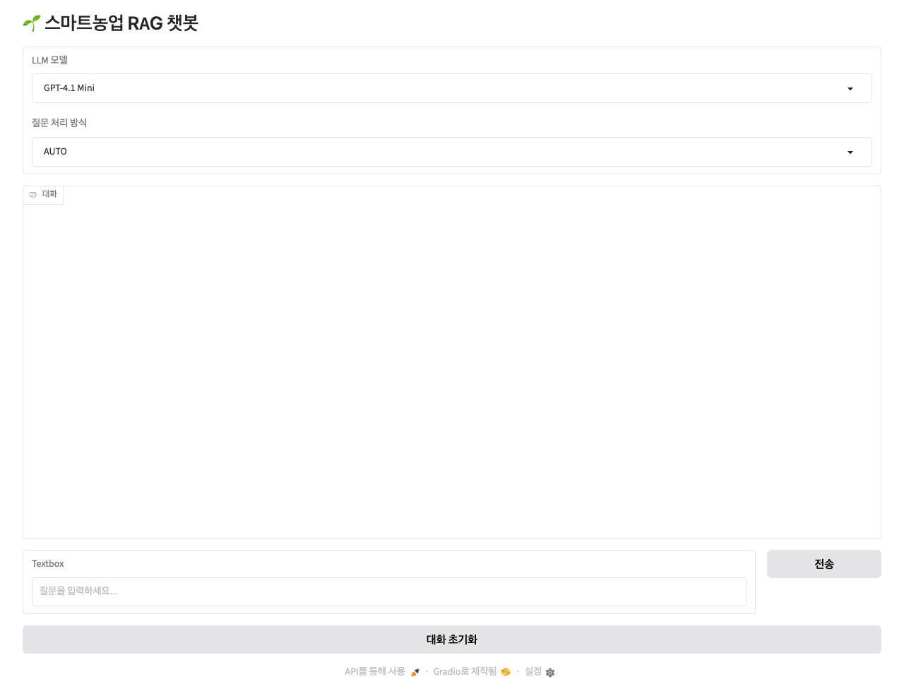

# RAG + LangGraph Agent Chatbot

## 문제 정의

문서 기반 챗봇은 LLM이 모든 지식을 기억한다고 가정하기보다, 필요한 문서를 검색하고 그 근거를 바탕으로 답변하는 구조가 필요합니다. 이 트랙은 PDF 처리, chunking, Chroma 검색, Router Chain, LangGraph Agent의 경계를 나누어 본 실습입니다.

## 사용 기술

- Python
- LangChain
- Chroma
- RAG
- Router Chain
- LangGraph
- FastAPI
- Gradio

## 실행 및 재현 방법

공개 저장소에서는 PDF 원본, OCR 산출물, Chroma DB를 포함하지 않습니다. 로컬에서 공개 가능한 문서를 준비한 뒤 각 실습의 문서 로딩/인덱싱 코드를 실행해야 합니다.

```bash
pip install -r day16/agri_rag_chatbot_langgraph2/requirements.txt
cd day16/agri_rag_chatbot_langgraph2
uvicorn app:app --reload
```

실행 전에는 `.env` 또는 환경 변수로 필요한 API key를 설정합니다. 실제 key는 저장소에 커밋하지 않습니다.

## UI Snapshot

아래 이미지는 API key나 실제 문서 검색을 실행하지 않고, Gradio 초기 화면만 캡처한 포트폴리오용 스냅샷입니다.



## 핵심 결과

- PDF를 바로 답변에 넣는 대신 chunking, embedding, vector store 단계를 분리했습니다.
- 일반 질문과 문서 질문을 나누기 위해 router 구조를 실습했습니다.
- LangGraph에서 tool 호출과 후처리 노드를 분리하는 흐름을 학습했습니다.

## GitHub Evidence

- [`day13`](../../day13)
- [`day14`](../../day14)
- [`day15/agri_rag_chatbot`](../../day15/agri_rag_chatbot)
- [`day16/agri_rag_chatbot_langgraph2`](../../day16/agri_rag_chatbot_langgraph2)

## 관련 Velog

- [PDF 문서를 검색 가능한 지식베이스로 바꾸기](https://velog.io/@sjh9714/hana-pdf-rag-knowledge-base)
- [금융/문서 챗봇에 Tool Router를 붙이며 배운 점](https://velog.io/@sjh9714/hana-langgraph-tool-router)

## 한계와 다음 단계

- 공개 저장소에는 원본 PDF와 벡터 DB를 포함하지 않으므로, 재현 시 공개 가능한 문서를 별도로 준비해야 합니다.
- 이후에는 retrieval 평가, hallucination 방지, citation 표시, 장애 처리 흐름을 보강할 수 있습니다.
